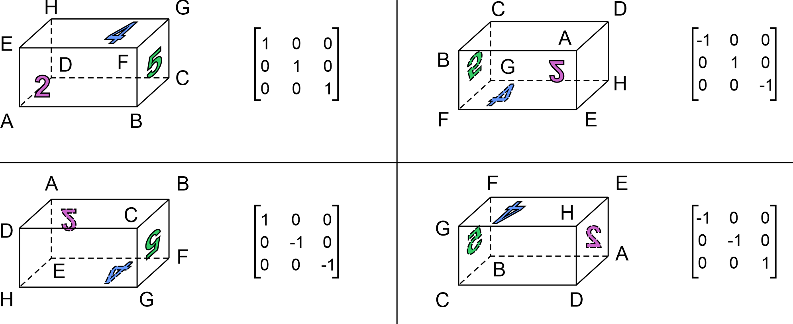
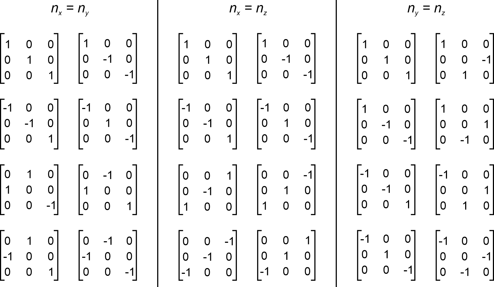
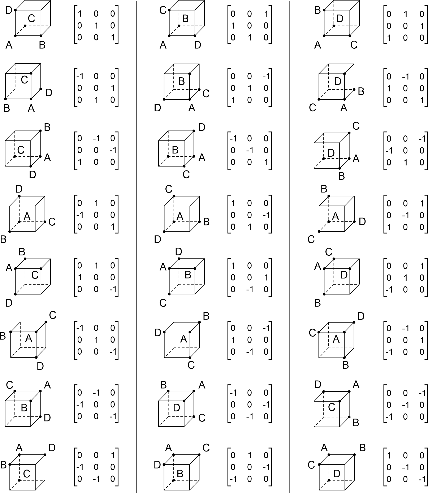

# 3Drot
Creating of a list of optimal 3D rotations

We generate a list of optimal 3D rotations. Each new rotation from the list is found in a way to minimise the 
gap in angular coverage for a global angular search or a local angular refinement problem.
Rotations can be combined in groups for some problems. 
The algorithm also works for those combined rotations. 

<b>Global problem.</b> We aim to find all possible rotations (there is no restrictions). The main application is to pre-rotate 3D datasets (as cuboids). 
In a general  case an object can be pre-rotated 4 times.

For each new rotation matrix we get group of 4 matrices using the matrices shown above.

If an object has two same dimensions, e.g. width and height are the same, then get rotations combined in groups of 8.

When all dimensions are the same, then we get 24 rotations in a group.

The code (quatGlobal.cpp) allows a user to generate the list of rotations. The code uses OpenMP and requries the use of Intel Compiler (can be obtained from <a href="https://software.intel.com/content/www/us/en/develop/tools/oneapi/all-toolkits.html">oneAPI</a>).

Parameters to modify (all in the first lines of the file with <tt>//Modify</tt> labels).
<ul>
  <li>Type of a problem (choose one of <tt>#define</tt> parameters: <tt>CASE_XYZ</tt>, <tt>CASE_ALL</tt>, <tt>CASE_XY</tt>, <tt>CASE_YZ</tt>, <tt>CASE_XZ</tt>).
  <li>Output folder <tt>outputFolder</tt>.</li>
  <li>By default, only a list of quaternions is geenrated. It is also possible to seed the output volume (it can be huge), to do this uncomment <tt>#define WRITE_OUTPUT</tt>.</li>
  <li>Number of items in the list (<tt>ITEMS_IN_THE_LIST</tt>).</li>
  <li>Size of grids used to generate rotations (parameters <tt>block_sizeh</tt> and <tt>nblocks</tt>). The size is then <tt>2 * block_sizeh * nblocks</tt> and will be a suffix in the output file. It seems that if the same size is set, the run times are smaller for smaller values of <tt>block_sizeh</tt>.</li>
  <li>Parameters <tt>nprintStep</tt> and <tt>nprintStepScreen</tt> control how often data is written to the output file or onto the screen. When you interupt the code, you should still have a file containing multiple of <tt>nprintStep</tt> quaternions.</li>
</ul>

Output file. Each line defines a rotation (only one rotation within a group, all other rotations can be found using the known rotation matrices)
<ul>
  <li>Index of a rotation.</li>
  <li>Four components of the corresponding quaternion.</li>
  <li>An estimate of the maximum distance between an arbitary rotation and the nearest rotation from the list (all rotations before and including the new one).</li>
  <li>The corresponding angular value for this distance (in degrees).</li>
</ul>

To compile the code you may use:

<tt>icpc quatGlobal.cpp -mssse3 -std=c++17 -lipps -lippcore -qopenmp -o rotGlobal.exe
</tt>

Run times and memory size when the code is run on a 6-core CPU (Intel, i5-10600KF, 4.1 Ghz, 6 cores, 12 threads), for 10,000 iterations:
<table>
  <tr><th>Size</th><th>Memory, GB</th><th>Time, s</th></tr>
  <tr><th>256</th><th>0.39</th><th>170</th></tr>
  <tr><th>384</th><th>1.31</th><th>514</th></tr>
  <tr><th>512</th><th>3.09</th><th>1125</th></tr>
  <tr><th>768</th><th>10.41</th><th>3433</th></tr>
  <tr><th>1024</th><th>24.66</th><th>7653</th></tr>
</table>

  
<b>Local problem.</b> Suppose there is a function defined for any possible rotation/orientation. A user may usually need to find those rotations when the function attains its minimum/maximum value. A list of rotations obtained for a global problem can be used to roughly estimate those solutions. Once the best rotations are roughly estimated we need to refine them. So, we just need to consider rotations around given ones (within some angular distance). For the local problem we specify this angular distance and generate a list of optimal rotations such that for any arbitarary rotation within the given angular distance its distance to the nearest rotation within the list is ever decreasing.

Code (quatLocal.cpp) is used for the local problem.

Parameters to modify are similar to the global problem.
<ul>
  <li>The angular range is defined by <tt>angleInDeg</tt>.</li>
</ul>

To compile the code you may use:

<tt>icpc quatLocal.cpp -mssse3 -std=c++17 -lipps -lippcore -qopenmp -o rotLocal.exe
</tt>

